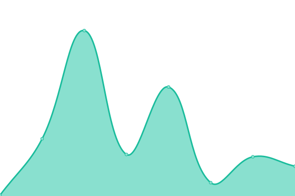

# [📈 Live Status](https://text-forge.github.io/uptime): <!--live status--> **🟩 All systems operational**

This repository contains the open-source uptime monitor and status page for [Text Forge](https://text-forge.github.io/uptime), powered by [Upptime](https://github.com/upptime/upptime).

With [Upptime](https://upptime.js.org), you can get your own unlimited and free uptime monitor and status page, powered entirely by a GitHub repository. We use [Issues](https://github.com/text-forge/uptime/issues) as incident reports, [Actions](https://github.com/text-forge/uptime/actions) as uptime monitors, and [Pages](https://text-forge.github.io/uptime) for the status page.

<!--start: status pages-->
<!-- This summary is generated by Upptime (https://github.com/upptime/upptime) -->
<!-- Do not edit this manually, your changes will be overwritten -->
<!-- prettier-ignore -->
| URL | Status | History | Response Time | Uptime |
| --- | ------ | ------- | ------------- | ------ |
|  [text-forge.github.io](https://text-forge.github.io) | 🟩 Up | [text-forge-github-io.yml](https://github.com/text-forge/uptime/commits/HEAD/history/text-forge-github-io.yml) | 

 178ms
     
 | 

<a href="https://text-forge.github.io/uptime/history/text-forge-github-io">100.00%</a>
    

|  [Docs](https://text-forge.github.io/docs) | 🟩 Up | [docs.yml](https://github.com/text-forge/uptime/commits/HEAD/history/docs.yml) | 

 145ms
     
 | 

<a href="https://text-forge.github.io/uptime/history/docs">100.00%</a>
    

|  [Online Marketplace](https://text-forge.github.io/marketplace) | 🟩 Up | [online-marketplace.yml](https://github.com/text-forge/uptime/commits/HEAD/history/online-marketplace.yml) | 

 156ms
     
 | 

<a href="https://text-forge.github.io/uptime/history/online-marketplace">100.00%</a>
    

|  [Marketplace API (Packages Information)](https://raw.githubusercontent.com/text-forge/mp/refs/heads/main/packages.json) | 🟩 Up | [marketplace-api-packages-information.yml](https://github.com/text-forge/uptime/commits/HEAD/history/marketplace-api-packages-information.yml) | 

 144ms
     
 | 

<a href="https://text-forge.github.io/uptime/history/marketplace-api-packages-information">100.00%</a>
    

<!--end: status pages-->

[**Visit our status website →**](https://text-forge.github.io/uptime)

## 📄 License

- Powered by: [Upptime](https://github.com/upptime/upptime)
- Code: [MIT](./LICENSE) © [Anand Chowdhary](https://anandchowdhary.com), supported by [Pabio](https://pabio.com)
- Data in the `./history` directory: [Open Database License](https://opendatacommons.org/licenses/odbl/1-0/)
